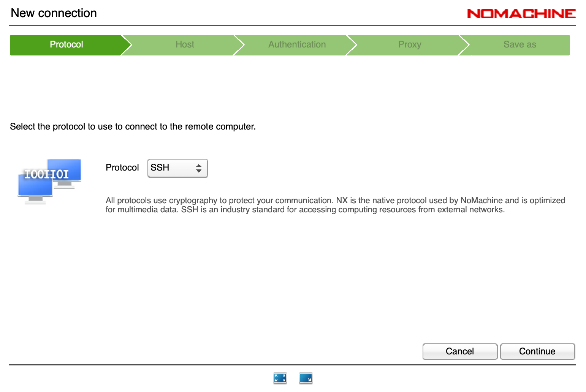
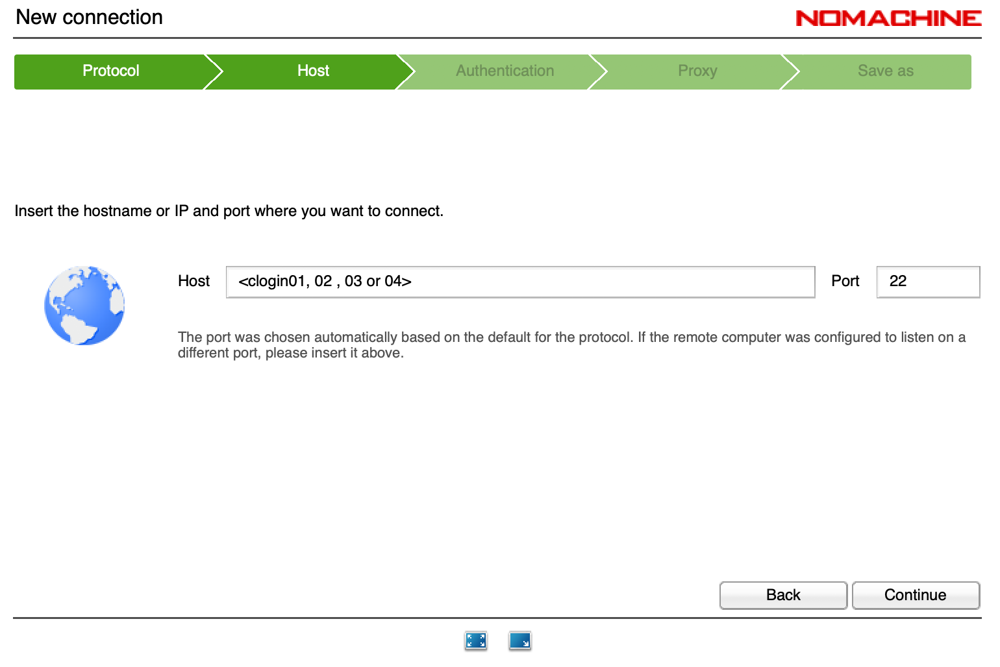
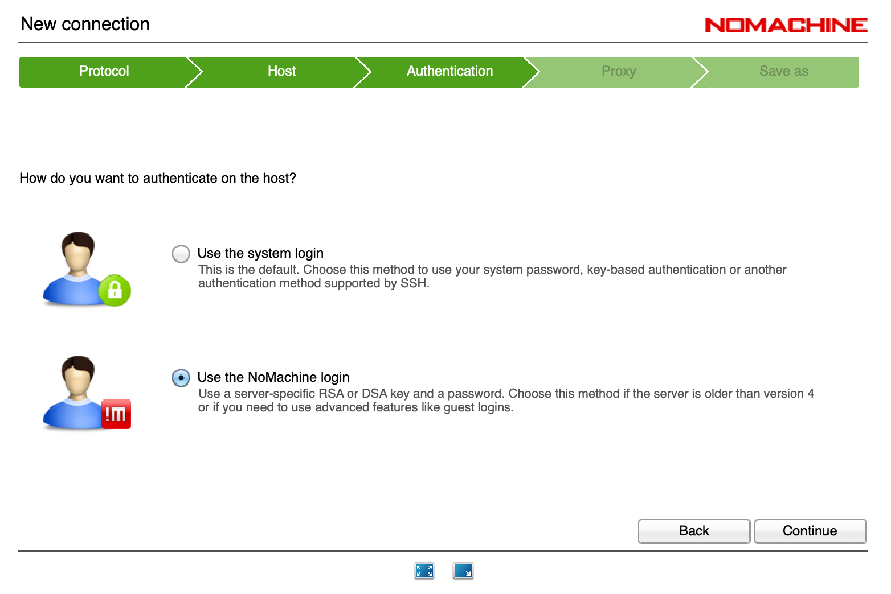
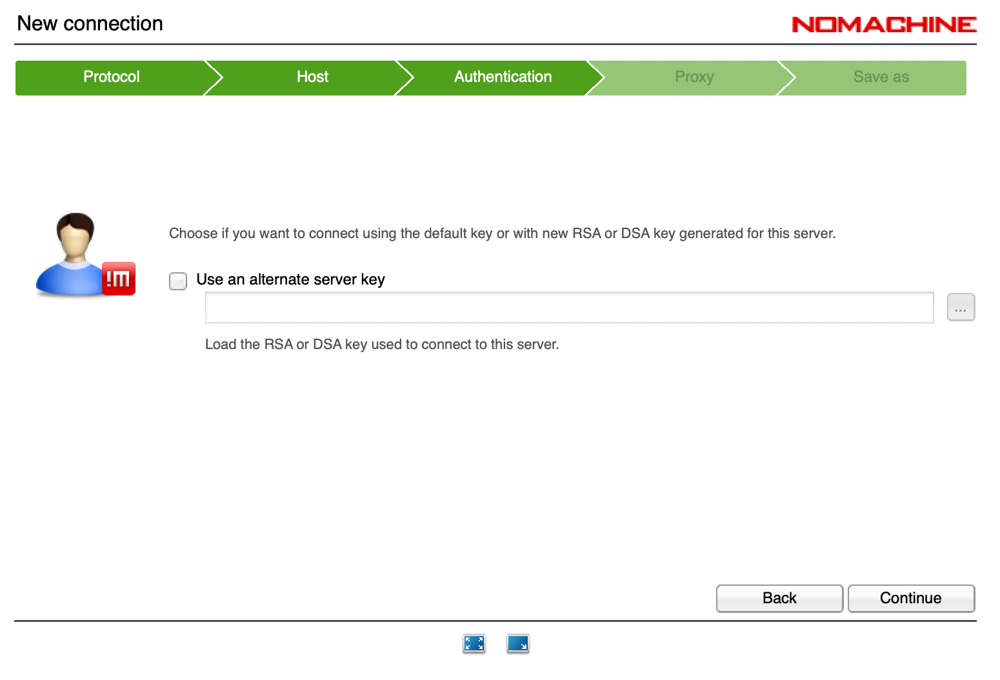
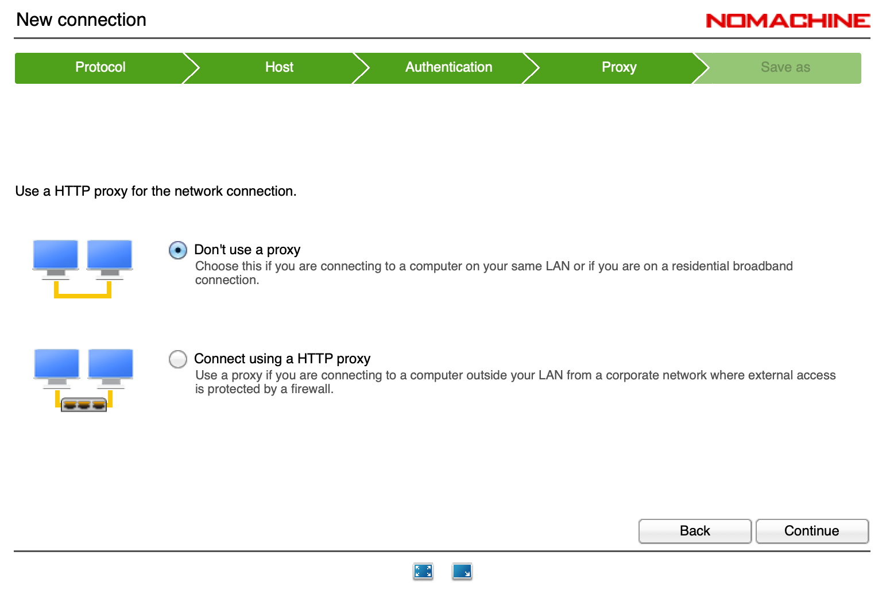
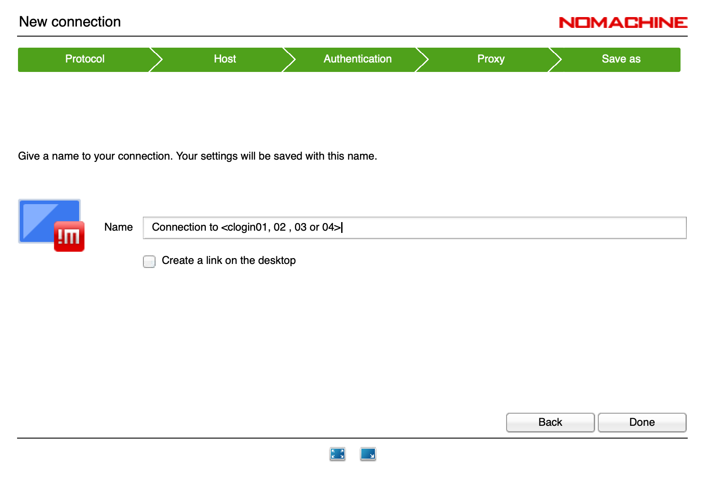

======
Access
======

Command Line Access
===================

All of the interactive nodes are available via SSH access.   SSH tools are
included by default on most Linux distributions and OSX.

Linux/OSX
---------

SSH access::

  ssh <username>@hostname/IP address

eg::

  ssh user@login-node

whereupon you will be prompted for a password

Windows
-------

There are several
alternatives for SSH access on Windows, with the most popular being PuTTY_

.. _PuTTY: http://www.chiark.greenend.org.uk/~sgtatham/putty/download.html

Transferring Data
=================

Linux/OSX
---------

Data can be transferred using scp/sftp, which encrypts all data in transit.   Transferring a file::

  scp localfile user@hostname:remotefile

You can also recursively copy a whole directory using the '-r' flag::

  scp -r localdirectory user@hostname:remotedirectory

Windows
-------

To transfer data to and from a Windows client, an additional program is required.   We recommend FileZilla_.
Filezilla supports FTP by default, but switches to SFTP if the port is updated to port 22.   Inputting the remote host of
an interactive node and using your username and password will allow you to copy files back and forth from the remote system.

.. _FileZilla: https://filezilla-project.org/

Graphical Access
================

To access graphical applications, an X server is required on your client.   This is generally installed on Linux, and can easily be
installed on OSX (xQuartz).   However, this does not offer any compression, and so can be particularly sluggish on remote connections.

We recommend the use of Nomachine to access our systems for graphical work. If you wish to use Nomachine, download the NoMachine client
and target the interactive nodes using the following configuration:

  SSH Protocol

  Input the IP of one of the clogin nodes

  Use Nomachine login

  No alternative key

  No proxy

  Name the connection

Unfortunately, for a variety of reasons the latest version of the Nomachine client is not supported on our system,
but Nomachine provide only the latest version on their download portal.   If you need a previous version of the client,
please contact support@cfms.org.uk